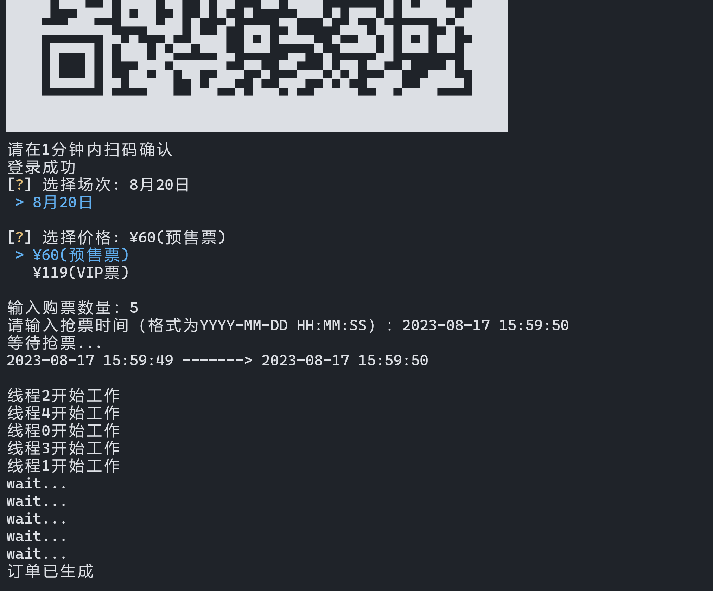

# py-bili

b站会员购漫展抢票，模仿的人工操作

#### 使用

安装python，chrome浏览器

```shell
git clone https://github.com/BsXwerse/py-bili.git

pip install -r requirements.txt
```

修改config.json

```json
{
    "target": "target url", //会员购详情页url
    "userinfo": {
        "name": "your name", //名字
        "phone": "your phonenumber" //手机号
    },
    "threadNum": 5 //几个线程抢
}
```

```shell
python .\main.py
```

> 注意不要选已经卖完的，二维码显示异常换个终端字体

---

#### 运行示例

